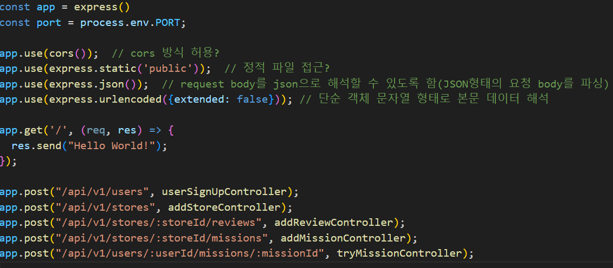
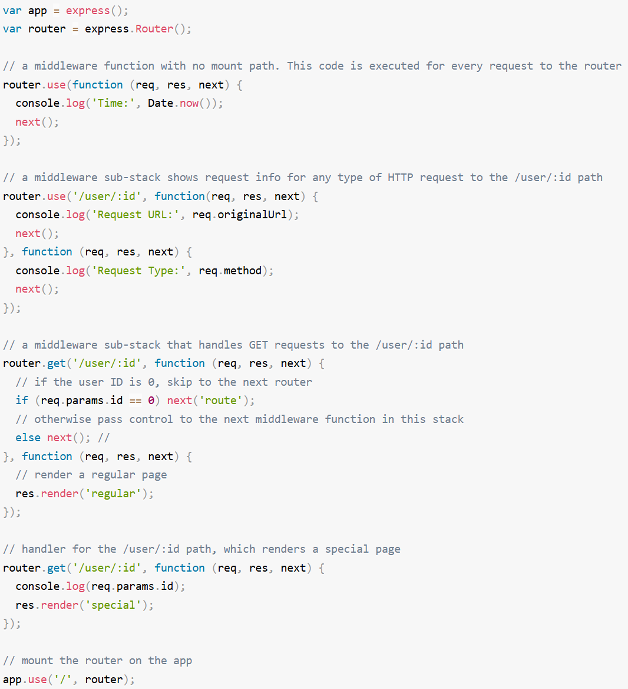

## 미들웨어

- 클라이언트로부터 요청이 오면 해당 요청이 특정 Controller를 통해 핸들링 되기 전에 미들웨어가 가로채서 요청이 유효한 요청인지 아닌지, 혹은 요청한 클라이언트가 인증된 클라이언트인지 등을 파악하는 중간 필터같은 역할을 하는 것이 미들웨어 이다.

- express 에서 미들웨어는 코드상의 순서로 미들웨어 순차적으로 처리가 되며 req, res, next 를 통해 해당 요청, 응답, 다음 미들웨어에 대한 접근이 가능하다

- 
    위 코드에서 cors(), express.static(), express.json은 모두 미들웨어 함수이다.

    클라이언트로 부터 들어온 요청에 대해 전처리 작업을 진행해준다.

- express 미들웨어는 총 3종류의 미들웨어가 있다

    1. app 레벨 미들웨어
        - app.use()
            메소드 종류에 상관없이 해당 경로의 요청을 모두 실행한다
        - app.HTTP_METHOD()
            메소드의 종류와 경로에 따라 구분되어 실행한다.

        위 두가지 함수를 이용해 미들웨어 구현이 가능하며

        마운트 경로가 없다면 모든 요청마다 해당 미들웨어를 항상 실행하게 된다
        
        위 코드는 마운트 경로가 없는 미들웨어이다.
        모든 요청에 대해서 현재시간을 콘솔창에 찍어준다.


        마운트 경로가 존재하면 해당 경로에 대한 요청이 들어올 때만 해당 미들웨어를 실행 시킨다.
        
        위 코드는 마운트 경로가 있는 미들웨어이다.
        요청중에 /user/:id 경로로 들어오는 것만 해당 미들웨어가 실행된다.

        
        위 코드는 하나의 마운트 경로를 통해 2개 이상의 미들웨어 함수를 로드하는 예이다.
        해당 경로로 요청이 오면 첫번째 미들웨어 함수가 실행되고 이후 다음 미들웨어 함수가 실행되고 다음 미들웨어로 전달된다.

        
        위 예시는 /user/:id 로 요청이 들어오는데 id가 0이면 route에 해당하는 미들웨어로 점프를 하게되어 두번째 미들웨어함수를 건너뛰게 되고 만약 0이 아니면 두번째 미들웨어 함수를 실행한다.

    2. 라우터 레벨 미들웨어
        ```
        const router = express.Router();
        ```
        다음과 같이 라우터 인스턴스를 생성하고
        
        ```
        router.use()
        router.METHOD()
        ```
        라우터로 들어오는 요청에 대해 app레벨 미들웨어처럼 use, method 함수를 통해 미들웨어를 실행할 수 있다.

        
        router.use , router.METHOD는 해당 라우터로 들어올 때 실행이 되는 미들웨어이며 아래에 app.use('/', router) 를 통해 '/' 경로로들어오는 모든 요청이 router로 가게되어 라우터에서 맞는 미들웨어를 처리하게된다.

    3. 오류 처리 미들웨어
        - 오류처리 미들웨어는 항상 4개의 인수가 필요하다
        - (err, req, res, next) 이 4개의 인수를 가진 미들웨어만이 오류를 파악할 수 있다
        - 오류처리 미들웨어는 다른 app.use() 및 라우트 호출을 정의 한후 마지막으로 정의해야한다.
            
            다음과 같이 마지막에 오류처리 미들웨어를 정의해야한다.

        - 오류처리 미들웨어에서 next()로 어떠한 내용을 전달할 때 next('route')말고는 Express는 현재의 요청에 어떤 오류가 있다고 간주하여, 오류 처리와 관련되지 않은 나머지 라우팅, 미들웨어 함수를 건너뛴다.


## HTTP 상태코드

서버에서의 처리 결과를 상태코드를 통해 파악할 수 있으며 상태코드는 세자리 숫자로 되어있고
백의 자리는 HTTP응답의 종류를 구분하는데 사용되고 나머지 두자리는 해당 응답종류에서 세부적인 응답 내용 구분을 위한 번호이다.

- 1xx
    - 정보제공
    - 임시응답으로 현재 클라이언트 요청까지는 처리 되었으니 계속 진행하라는 의미이다.


- 2xx
    - 성공
    - 클라이언트의 요청이 서버에서 성공적으로 처리되었음을 의미한다.
        1. 200
            OK : 서버가 요청을 성공적으로 처리하였다.
        2. 201
            Created : 요청이 처리되어 새로운 리소스를 생성하였다.
        3. 202
            Accepted : 요청은 접수하였지만, 처리가 완료되지 않았다.

- 3xx
    - 리다이렉션
    - 완전한 처리를 위해 추가동작이 필요한경우로, 서버의 주소 또는 요청한 URI의 웹 문서가 이동되었으니 그 주소로 다시 시도하라는 의미이다.
        1. 301
            Moved Permanently : 지정한 리소스가 새로운 URI로 이동하였다.
        2. 303
            See Other : 다른 위치로 요청하라, 브라우저의 폼 요청을 POST로 처리하고 그 결과 화면을 리다이렉트시킬 때 자주 사용하는 응답코드이다.
        3. 307
            Temporary Redirect : 임시 리다이렉션, 요청한 URI가 없으므로 클라이언트 메소드를 그대로 유지한채 응답헤더 Location에 표시된 다른 URI로 요청을 재송신할 필요가 있음을 알려줌

- 4xx
    - 클라이언트 에러
    - 없는 페이지요청 등 클라이언트의 요청메시지 내용이 잘못된 경우를 말한다.
        1. 400
            Bad Request : 잘못된 요청, 요청의 구문이 잘못되었다.
        2. 401
            Unauthorized : 권한 없음, 지정한 리소스에 대한 액세스 권한이 없다.
        3. 403
            Forbidden : 금지됨, 지정한 리소스에대한 액세스가 금지되었다., 401인증처리 이외의 사유로 리소스에 대한 액세스가 금지 되었음을 의미한다.
        4. 404
            Not Found : 지정한 리소스를 찾을 수 없다.

- 5xx
    - 서버에러
    - 서버사정이라 요청처리에 문제가 발생한 경우로, 서버의 부하 DB 처리과정오류, 서버에서의 예외발생 의 경우를 의미한다.
        1. 500
            Internal Server Error : 내부서버 오류, 서버에 에러가 발생
        2. 501
            Not Implemented : 구현되지 않음, 요청한 URI 메소드에 대해 서버가 구현하고 있지 않다.
        3. 502
            Bad Gateway : 불량 게이트웨이, 게이트웨이 또는 프록시 역할을 하는 서버가 그 뒷단의 서버로 부터 잘못된 응답을 받았다.


        
    