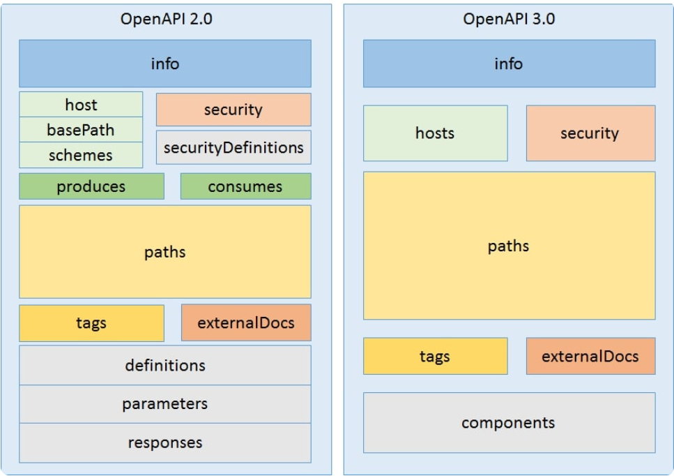

## 스웨거
- OpenAPI Specification을 구현하기위한 툴이다.
- Swagger에는 다양한 툴들이 있는데 아래와 같다
    - Swagger Editor
        - YAML 형식으로 되어있는 OpenAPI 명세를 브라우저에서 편집이 가능하게 해주고 실시간으로 문서를 프리뷰 해준다.
    - Swagger UI
        - HTML, Javsscript, CSS 에셋의 집합으로 동적으로 문서를 이쁘게 생성해준다.
    - Swagger Codegen
        - OpenAPI를 먼저 생성하고 해당 포맷에 맞게 개발이 이루어지도록 Server 나 Client의 stub code 생성
    - Swagger Inspector
        - API 테스트를 위한 툴로 API의 검증, 존재하는 API를 통해 OpenAPI 정의를 생성해준다.
    - SwaggerHub
        - OpenAPI를 이용해 팀으로 협업하는 이용자들을 위해 만든 API design, documentation이다.

## OAS(OpenAPI Specification)
- Open Api Specification
- RESTful 웹서비스를 약속된 규칙에 맞게 API 스펙을 json과 yaml 형식으로 표현해준다.
- 이를 이용해 사용자가 API에 대한 소스코드를 보거나 추가 문서를 볼 필요 없이 해당 서비스를 이해할 수 있도록 한것이다.

- OpenAPI는 아래의 내용을 설명해준다
    - 가능한 endpoint들과 각각의 endpoint에서의 동작들(GET /users, POST /users) 등
    - 각 API를 이용하기위한 파라미터들(Path variable, Query string, request body)등
    - 인증방법(token)
    - 연락처 정보, 라이선스, 사용약관 등


## OpenAPI 버전별 특징


### JSON Schema 확장제공
- OpenAPI 3.0 이후 JSON Schema 에 더욱 확장해서 지원가능해졌다.
- 더 많은 JSON Schema 키워드들을 사용할 수 있게 되었다.

### CallBacks 에 대한 표현 지원여부
- OpenAPI 3.0 이후 콜백에 대한 표현을 지원가능하게 했다.
- Callbacks는 real-time에서 커뮤니케이션이 발생하는 비동기적 API들에 대한 설명을 가능하게 한다.
- 예를들어 물류회사에서 배송되는 소포에 대해 알림을 받기위해 구독을 했다면 "소포가 배송되었다" 혹은 "소포가 배달되었다" 를 알려주는 API로 부터 공지를 받을 것이다.
```
callbacks:
  notification:
    '{$request.body#/url}?token={$request.body#/token}':
      post:
        summary: 'Receive single notification about a parcel'
        requestBody:
          required: true
          content:
            application/json:
              schema:
                $ref: '#/components/schemas/notification'
        responses:
          200:
            description: 'Notification successfully processed'
            content:
              text/plain:
                examples:
                  ok:
                    value: 'ok'
```
- OpenAPI 2.0에서는 이러한 콜백을 표현하는 방식이 없었다


### Endpoint URL 정의

#### OpenAPI 2.0
- API Endpoint URL을 3가지 (host, basePath, schemes)로 정의
    ```
    "host" : ,
    "basePath" : ,
    "schemes" : 
    ```
- 위의 스펙 에서는 하나의 endpoint URL 만 정의 할 수 있었음

#### OpenAPI 3.0
- 2.0과 다르게 멀티 URL을 지원한다
- 각 URL 마다 username, port, basePath를 variables 필드에 갖고있다
    ```
    "servers": [
        {
        "url": "https://{username}.gigantic-server.com:{port}/{basePath}",
        "description": "The production API server",
        "variables": {
            "username": {
            "default": "demo",
            "description": "this value is assigned by the service provider, in this example `gigantic-server.com`"
            },
            "port": {
            "enum": [
                "8443",
                "443"
            ],
            "default": "8443"
            },
            "basePath": {
            "default": "v2"
            }
        }
        }
    ]
    ```

### Parameter 표현에 대한 개선
- OpenAPI 3.0에서는 body와 formData 타입의 parameter가 사라지고 그 대신 requestBody 라는 것이 대체를 했다.

- cookie라는 파라미터 타입이 추가되었다. 쿠키 인증이 2.0에서는 지원이 안되었지만, API keys를 쿠키를 통해 전달할 수 있게 되었다. 마치 API를 인증을 위한 토큰이나 Oauth처럼 가능하다.


### Component에 대한 유무
#### OpenAPI 2.0
- 예전에는 일부 중복되는 부분이 있어도 그대로 쓸 수 밖에 없었다.
- 각 path의 schema 아래부분에 해당
```
paths:
  /users/{userId}:
    get:
      summary: Get a user by ID
      parameters:
        ...
      responses:
        '200':
          description: A single user.
          content:
            application/json:
              schema:
                type: object
                properties:
                  id:
                    type: integer
                  name:
                    type: string
  /users:
    get:
      summary: Get all users
      responses:
        '200':
          description: A list of users.
          content:
            application/json:
              schema:
                type: array
                items:
                  type: object
                  properties:
                    id:
                      type: integer
                    name:
                      type: string
```

#### OpenAPI 3.0
- 중복되는 부분에 대해 components로 빼고 path에서는 참조를 할 수 있게 했다.
- components에서는 schemas, parameters, responses, examples, security schemes, links, request bodies, headers, callbacks를 포함 하고 있어, 재사용 가능한 모듈로 사용이 가능하다
```
paths:
  /users/{userId}:
    get:
      summary: Get a user by ID
      parameters:
        ...
      responses:
        '200':
          description: A single user.
          content:
            application/json:
              schema:
                $ref: '#/components/schemas/User'
  /users:
    get:
      summary: Get all users
      responses:
        '200':
          description: A list of users.
          content:
            application/json:
              schema:
                type: array
                items:
                  $ref: '#/components/schemas/User'
components:
  schemas:
    User:
      type: object
      properties:
        id:
          type: integer
        name:
          type: string
```

