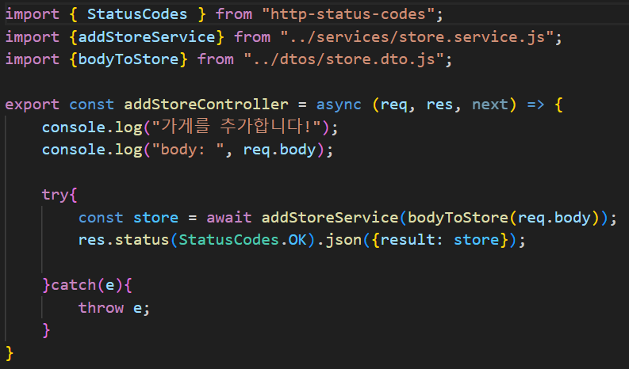
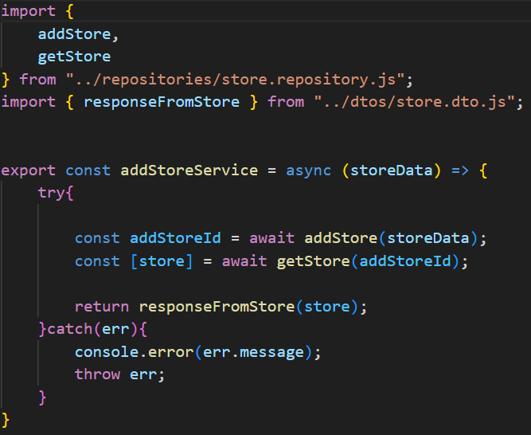
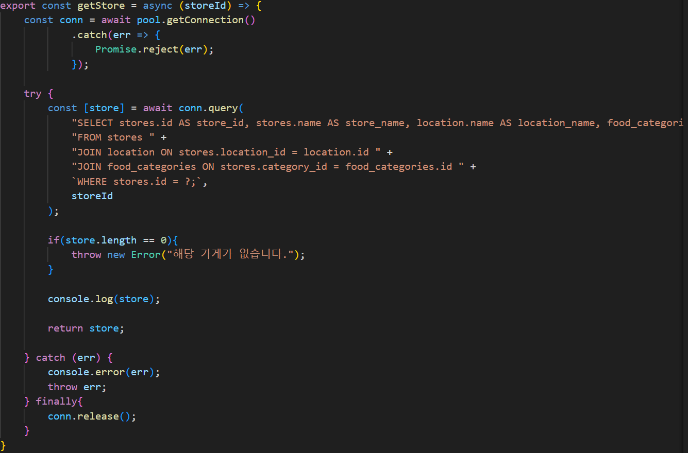
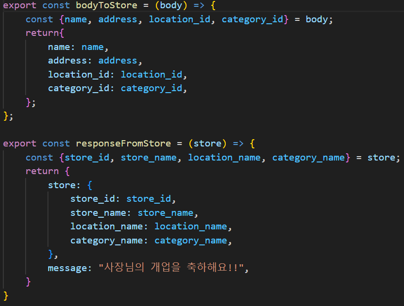
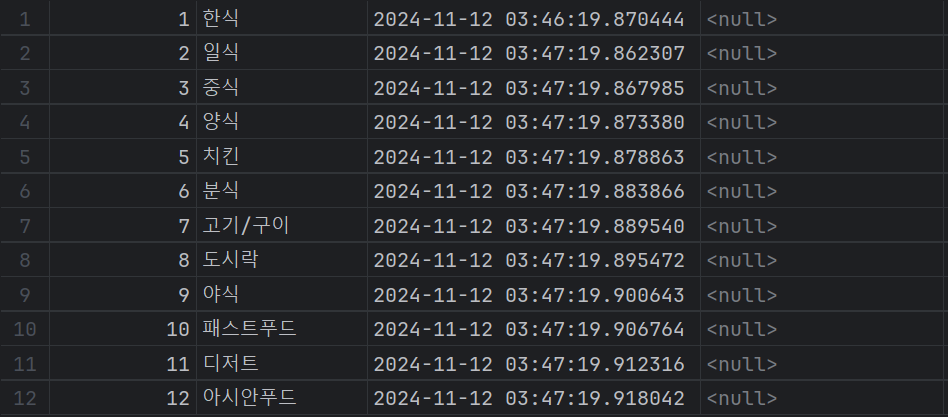
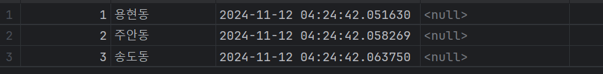
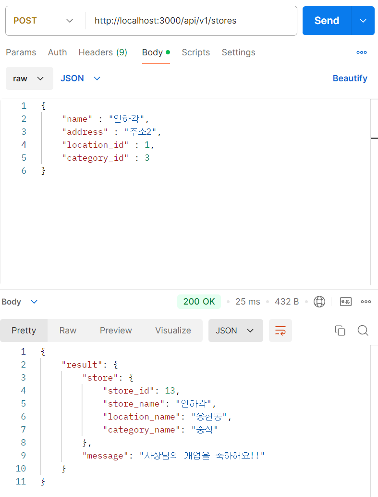
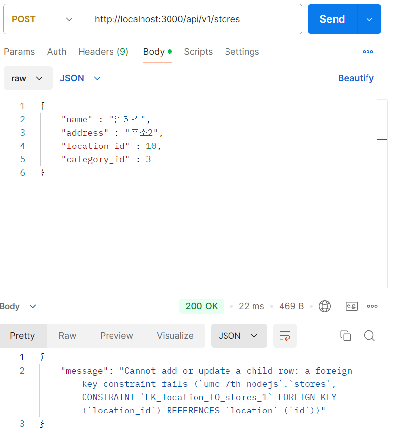
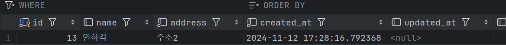

## 각 api 마다 이슈 생성

## 특정지역에 가게 추가 API 구현

### 이슈

### Controller

### Service

### Repository
 

### DTO

### 결과

#### 초기 데이터
아래는 음식 카테고리에 대한 초기 데이터 값이다.
음식 카테고리가 있어야 가게에 음식카테고리를 추가가능하므로 초기 데이터 설정이 필요합니다.

아래는 위치에 대한 초기 데이터 값이다.
특정지역에 가게를 추가해야하기에 지역에 대한 데이터가 있어야합니다.

#### Postman 실행 결과

아래는 성공 했을때의 모습

아래는 실패 했을때의 모습(category_id 또는 location_id 가 데이터 범위에 벗어나는 경우)

에러 문구는 error 보여주는 방식으로 에러처리
상태코드 변경도 추후 변경해야함

아래는 stores 테이블에 데이터가 잘 들어간 모습이며
에러가 발생한 요청에 대한 데이터는 들어가있지 않다.

##

