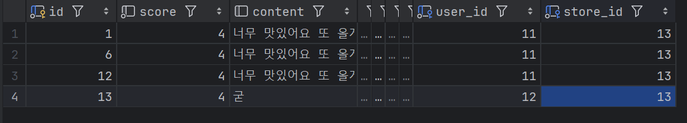
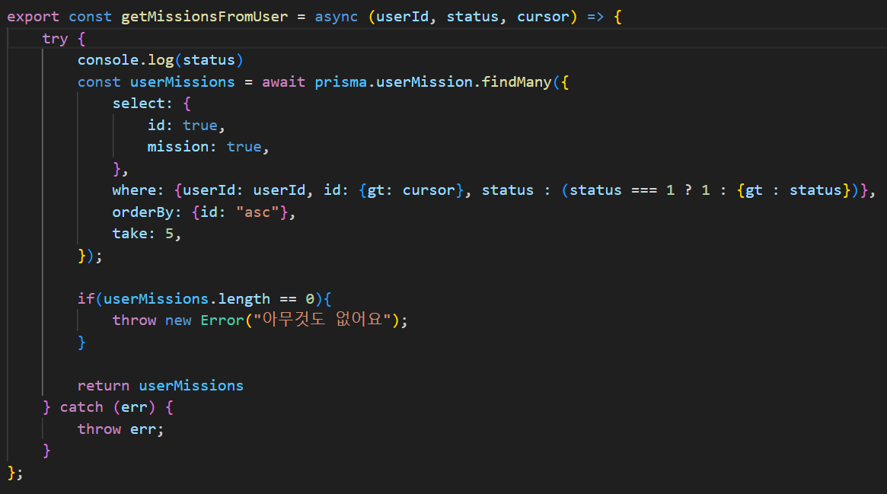
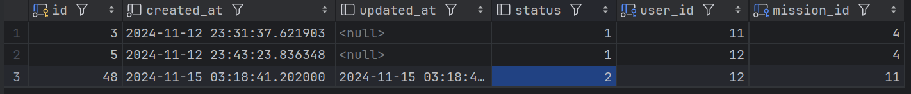

## 각 api 마다 이슈 생성

## 내가 작성한 리뷰 목록 구현하기

### 이슈

### Controller

### Service

### Repository
 

### DTO

### 결과

#### 초기 데이터
아래는 리뷰에 대한 데이터이다.

11번 유저가 13번 가게에 3개의 리뷰를 남겼다.
12번 유저가 13번 가게에 1개의 리뷰를 남겼다.

#### Postman 실행 결과

아래는 성공 했을때의 모습

없는 유저를 입력했을 때

## 특정 가게의 미션 목록 구현하기

### 이슈

### Controller

### Service

### Repository

### DTO

### 결과

#### 초기 데이터
아래는 미션에 대한 데이터이다.

13번 가게의 미션이 여러개 있다.

#### Postman 실행 결과
아래는 성공 했을 때의 모습이다.

아래는 없는 가게의 미션을 가져오려할 때의 모습이다.

## 내가 진행중인 미션목록 구현하기

### 이슈

### Controller

### Service

### Repository

### DTO

### 결과

#### 초기 데이터
아래는 미션에 대한 데이터이다.

현재 12번 유저가 4번 미션을 진행하고있으며(1) 11번 미션은 이미 완료한 상태이다(2)

#### Postman 실행 결과

아래는 12번 유저의 진행중인 미션을 불러왔다.

쿼리스트링으로 status=ongoing을 주었다.

아래는 아무런 쿼리를 주지않았을 때이며 유저의 모든 미션을 보여준다.

없는 유저를 입력했을 때는 다음과 같다.

## 진행중인 미션을 미션완료로 바꾸기

#### 깃허브 레포지토리
https://github.com/GodUser1005/UMC-7th-Nodejs/tree/feature/mission-06