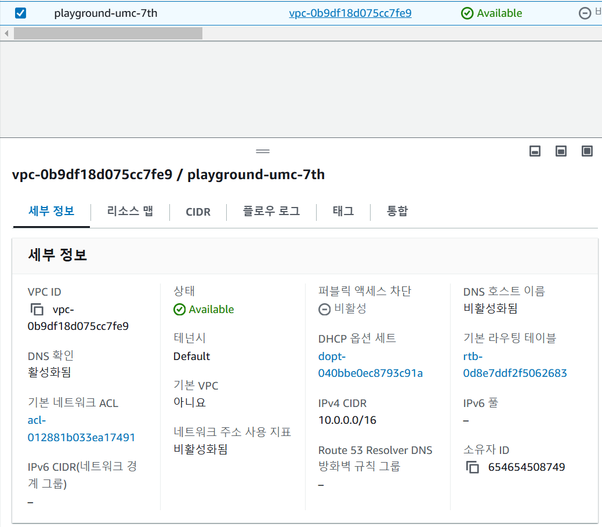
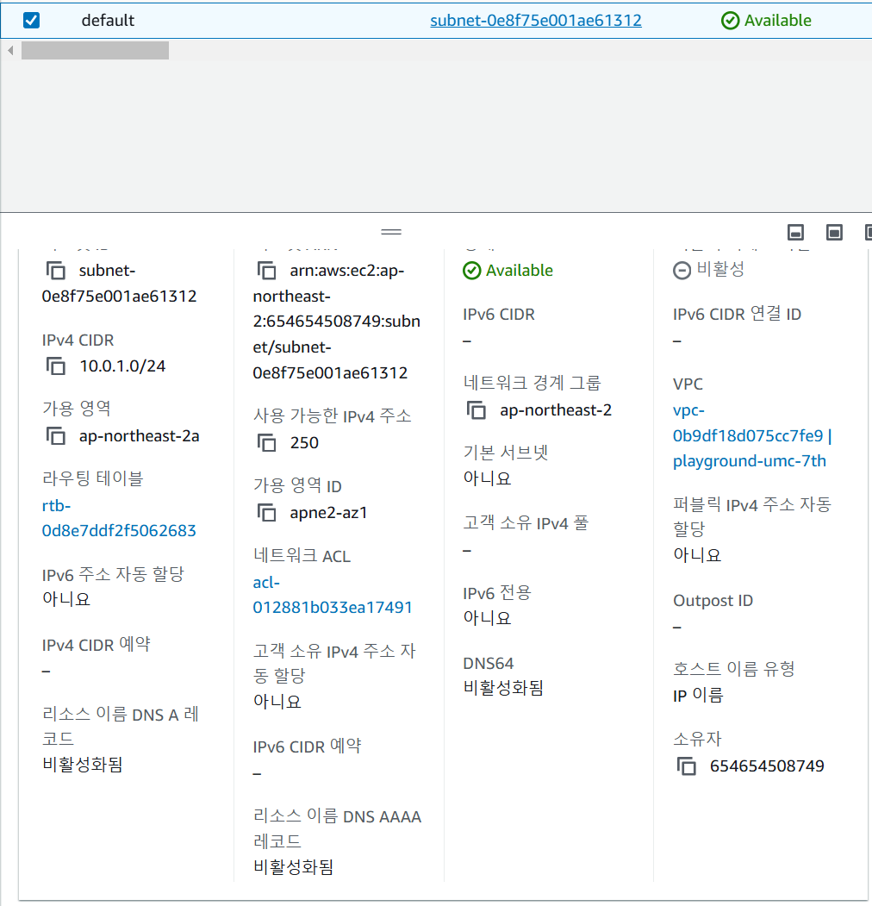
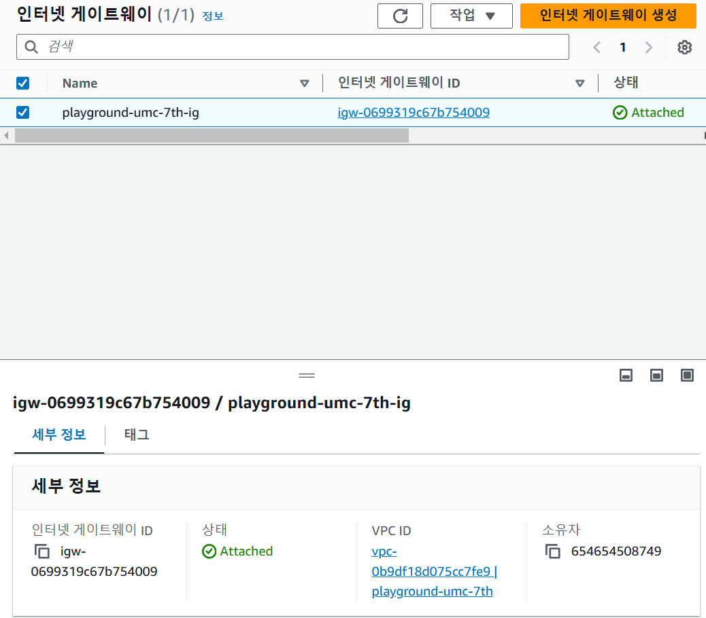
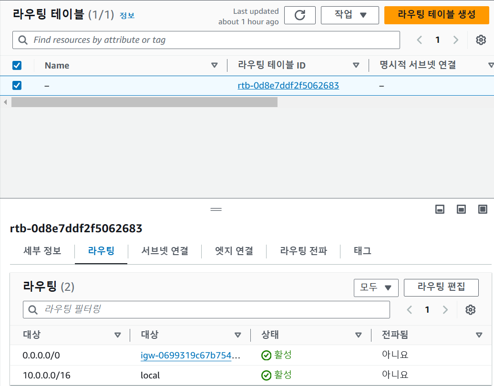
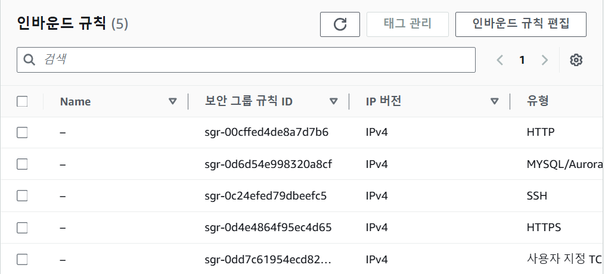
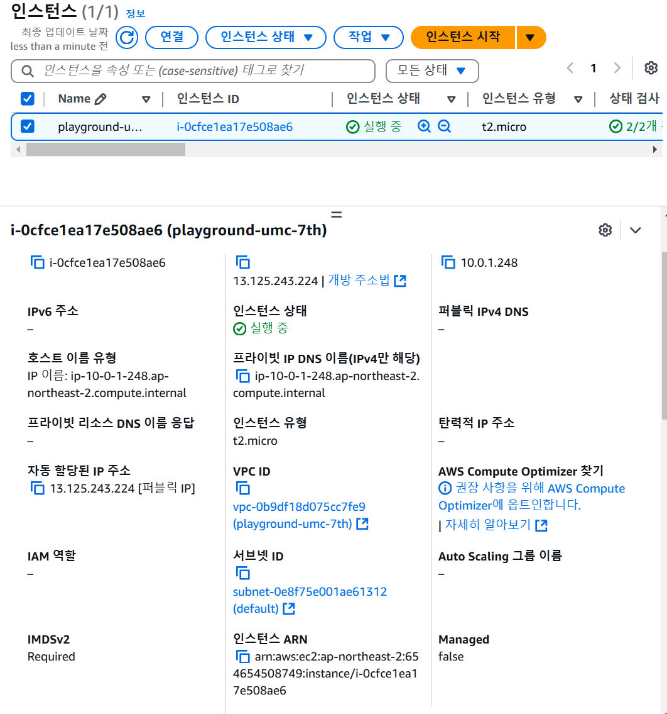
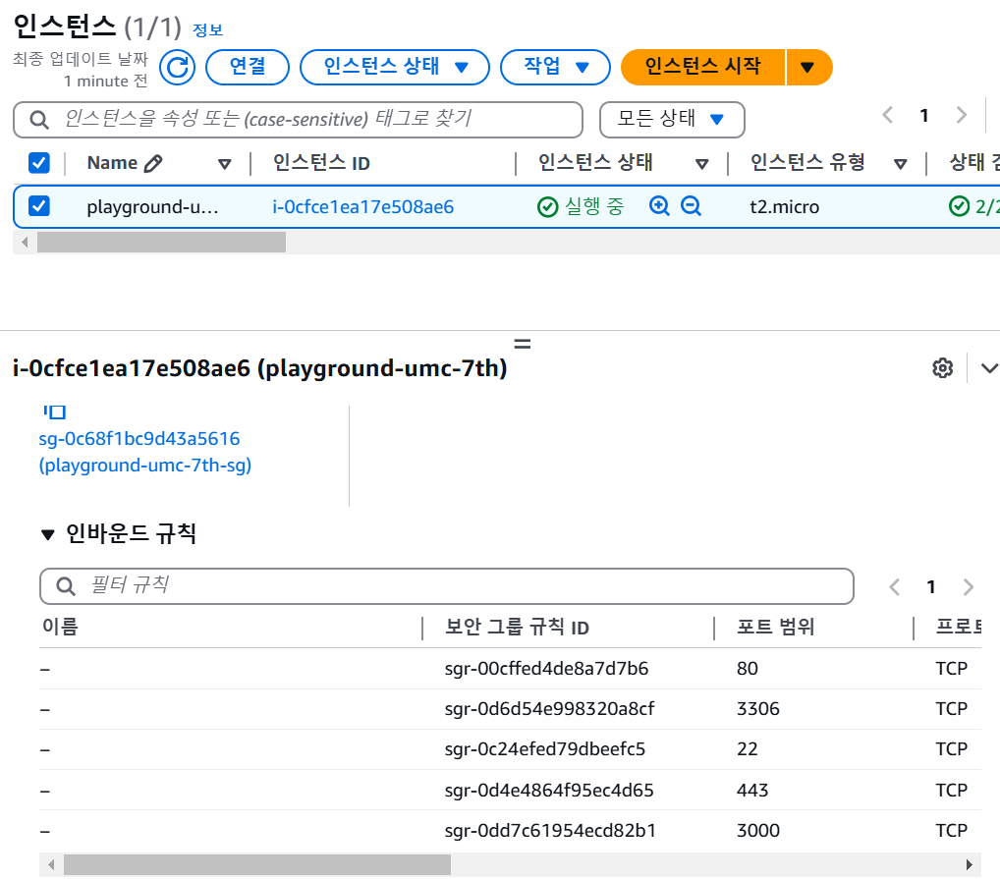
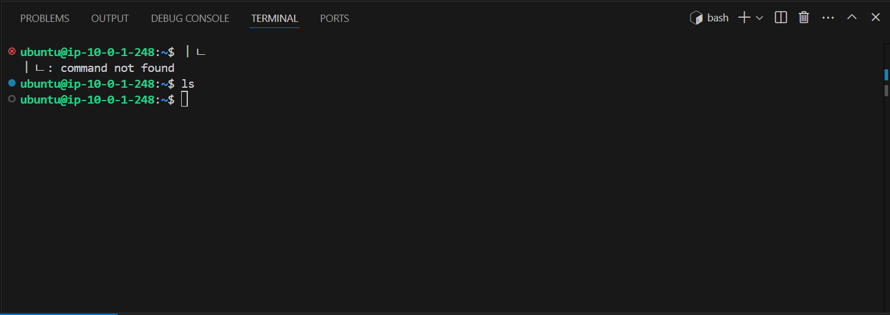
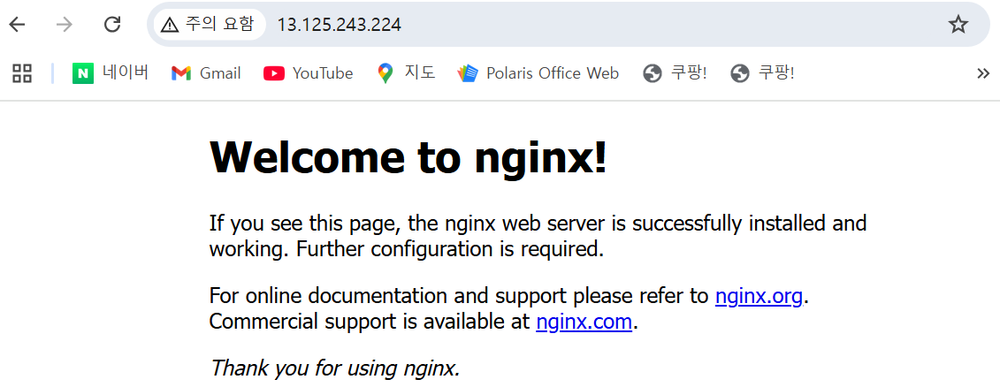

## VPC 구성

- CIDR : 10.0.0.0/16 으로 VPC 구성

## VPC 내부에 subnet 구성

- default 라는 이름의 퍼블릭 서브넷 구성(외부와 연결이 되어있음)
- CIDR : 10.0.1.0/24 으로 서브넷 구성

## 인터넷 게이트웨이 설정

- VPC에 인터넷 게이트웨이를 생성

## 라우팅 테이블 설정

- 라우팅 테이블에서 들어오는 모든 주소에 대해 인터넷 게이트웨이로 연결
- 10.0.0.0/16 으로 가고자 하는 것만 local로 연결 내부 라우터가 해결

## 보안그룹 인바운드 설정

- 해당 포트로 들어오는 것에 대해 보안그룹을 위와 같이 설정
- 3000 포트를 열어두는 이유는 서버에 대한 포트

## EC2 생성

- default 서브넷에 EC2 인스턴스 생성

- 만든 보안그룹 설정

## SSH 접속

## Nginx 설치및 해당 ip접속

